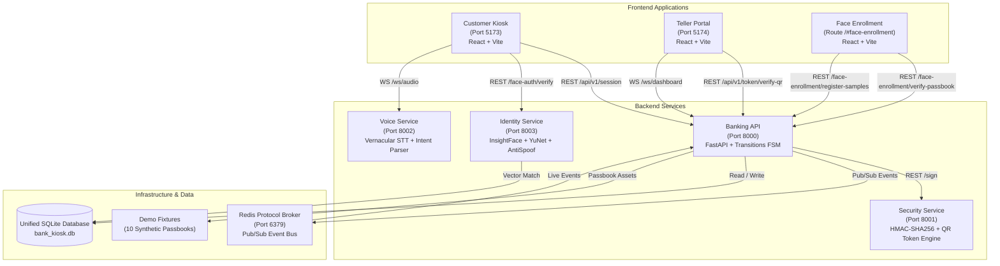
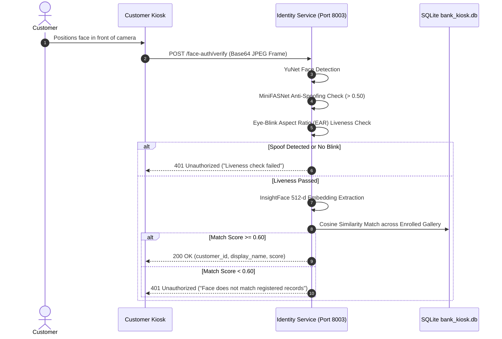

# AI Voice-Assisted Banking Kiosk

An enterprise-grade, accessible, service-oriented banking kiosk platform engineered to eliminate literacy, language, and operational friction in retail bank branches through vernacular voice AI, contactless biometric authentication, and cryptographically verified teller workflows.

---

## 1. Project Overview

The **AI Voice-Assisted Banking Kiosk** is an integrated omnichannel branch automation solution. It bridges the accessibility gap for elderly, low-literacy, and rural customers who struggle with traditional ATM interfaces or handwritten paper slips.

By orchestrating real-time vernacular speech-to-text, natural language intent recognition, on-device facial anti-spoofing biometrics, and HMAC-SHA256 one-time digital transaction tokens, the platform transitions walk-in banking counter encounters from an average of **4 minutes down to under 30 seconds**.

---

## 2. Key Capabilities

- **Vernacular Conversational AI**: Native speech recognition and natural language entity parsing in English, Tamil, and Tanglish (Tamil-English code-switching).
- **Contactless 2FA Biometric Authentication**: Deep neural network face recognition with multi-sample gallery matching, passive eye-blink liveness verification, and MiniFASNet anti-spoofing.
- **Dynamic Real-Time Account Ledger**: Instant deposit, withdrawal, and balance reconciliation with persistent SQLite transactional safety.
- **Cryptographic One-Time QR Tokens**: HMAC-SHA256 signed 1800-second expiring payloads preventing tampering, replay attacks, and man-in-the-middle manipulation.
- **Dual Thermal Receipt Generation**: High-resolution, professional PDF receipts for customer confirmation and teller counter physical audit trails.
- **Teller Queue Management & Operations Portal**: Instant webcam and file-upload QR scanning with real-time WebSocket queue updates.
- **Isolated Face Enrollment & OCR Onboarding**: Passbook OCR verification with multi-angle biometric sample enrollment isolated from the public customer kiosk.

---

## 3. System Architecture

The platform is engineered as an integrated service-oriented architecture with decoupled frontends, domain microservices, an embedded protocol broker, and unified persistent storage.



---

## 4. Workflows & Lifecycles

### A. Customer Journey
1. **Welcome & Language Selection**: Customer selects preferred vernacular language (English or Tamil) with audio prompts and high-contrast visuals.
2. **Contactless Biometrics**: Customer looks into the kiosk camera. Identity Service detects the face, tests liveness/anti-spoofing, and identifies the account.
3. **Conversational Voice Banking**: Customer speaks naturally (e.g., *"Deposit five thousand rupees"* or *"பத்தாயிரம் ரூபாய் டெபாசிட் செய்"*).
4. **Visual & Auditory Confirmation**: Kiosk displays structured transaction details and requests final touch or voice confirmation.
5. **Signed QR & Receipt**: Customer receives an HMAC-signed digital QR token on screen with option to print/download the official transaction receipt.

### B. Authentication & Anti-Spoofing Flow


### C. Voice Transaction Flow
1. **Audio Ingestion**: Audio stream captured via Web Audio API and transmitted via `WS /ws/audio` to the Voice Service.
2. **Vernacular Transcription**: Audio decoded into natural language text in English or Tamil.
3. **Entity Extraction**: `intent_parser.py` extracts intent (`WITHDRAWAL`, `DEPOSIT`, `BALANCE_ENQUIRY`, `SEND_MONEY`) and numerical currency values (handling multipliers like *lakh*, *thousand*, *ஆயிரம்*).
4. **Backend FSM Validation**: Dispatched to Banking API (`POST /api/v1/voice-intent`) to update session state machine.

### D. QR & Security Flow
1. **Payload Generation**: Banking API dispatches validated transaction parameters to Security Service (`POST /sign`).
2. **HMAC-SHA256 Signing**: Security Service generates a cryptographically random UUIDv4 token ID, builds a deterministic JSON token payload, and signs with a 256-bit secret key.
3. **One-Time Session Store**: Token cached in memory with a 1800-second TTL.
4. **Base64 QR Encoding**: Emitted to Customer Kiosk as a scannable QR payload.

### E. Teller Workflow & Receipt Lifecycle
1. **Queue Notification**: Real-time push via WebSocket (`/ws/dashboard`) alerts teller to pending customer tokens.
2. **QR Verification**: Teller scans printed or mobile QR code via counter webcam or file upload (`POST /api/v1/token/verify-qr`).
3. **One-Time Consumption**: Backend verifies HMAC signature, confirms expiry window, and invalidates the token against replay attacks.
4. **Transaction Processing**: Teller reviews customer details and clicks **Process Transaction**. Balance updates atomically in `bank_kiosk.db`.
5. **Teller Acknowledgement Receipt**: Teller prints an official, centered counter acknowledgement receipt for physical branch auditing.

### F. Face Enrollment Workflow
1. **Physical Passbook Verification**: Dedicated enrollment interface (`/#face-enrollment`) accepts an uploaded passbook image.
2. **OCR / Demo Fixture Matching**: Windows native OCR or demo fixture SHA-256 matching validates account credentials against customer records.
3. **Multi-Sample Capture**: Customer captures 4 distinct facial angles (center, slight left, slight right, smile).
4. **Gallery Enrollment**: 512-d embeddings are normalized and persisted in `bank_kiosk.db`.

---

## 5. Technology Stack

| Domain | Technology / Library | Purpose |
|---|---|---|
| **Frontends** | React 18, Vite, Lucide Icons, jsPDF, html2canvas | High-performance reactive web interfaces |
| **Banking API** | FastAPI, Pydantic v2, Transitions FSM, Uvicorn | Session orchestration and account business logic |
| **Voice Service** | FastAPI, WebSockets, Python Sound Pipeline | Real-time vernacular speech parsing and entity extraction |
| **Identity Service** | InsightFace (ArcFace), YuNet ONNX, MiniFASNet, OpenCV | Biometric detection, liveness, and face matching |
| **Security Service** | PyCryptodome, QRCode, Base64 | HMAC-SHA256 signing and one-time token verification |
| **Data & Storage** | SQLite3 (WAL mode), Fakeredis TCP Broker | ACID persistent database and Redis pub/sub broker |
| **Automation** | Windows Batch Scripts, PowerShell | Fully portable, location-independent system launcher |

---

## 6. Repository Structure

```
Voice-Assisted-Bank-Kiosk/
│
├── apps/                                  # Frontend Applications
│   ├── customer-kiosk/                    # Touchscreen & voice customer terminal (Port 5173)
│   │   ├── src/                           # React components, screens, services
│   │   ├── public/                        # Static assets, branding
│   │   ├── index.html                     # HTML5 template
│   │   ├── package.json                   # Dependencies: customer-kiosk
│   │   └── vite.config.js                 # Vite build settings
│   │
│   └── teller-portal/                     # Teller counter & QR processing app (Port 5174)
│       ├── src/                           # React components, QR scanner, queue
│       ├── public/                        # Static assets, brand icons
│       ├── index.html                     # HTML5 template
│       ├── package.json                   # Dependencies: teller-portal
│       └── vite.config.js                 # Vite build settings
│
├── services/                              # Microservices Layer
│   ├── banking-api/                       # Central Orchestrator & Banking API (Port 8000)
│   │   ├── app/                           # Routers, FSM, services, session store
│   │   ├── mocks/                         # Test fixtures & mocks
│   │   └── requirements.txt               # API dependencies
│   │
│   ├── identity/                          # Face Authentication & Anti-Spoofing (Port 8003)
│   │   ├── app/                           # Face routes, antispoof, db adapter
│   │   ├── models/                        # ONNX biometric weights (YuNet, MiniFASNet, ArcFace)
│   │   └── requirements.txt               # Identity dependencies
│   │
│   ├── security/                          # Cryptographic Token & QR Service (Port 8001)
│   │   ├── crypto.py                      # HMAC-SHA256 signing & validation
│   │   ├── qr_generator.py                # QR matrix generation
│   │   ├── token_service.py               # Token lifecycle & TTL management
│   │   └── requirements.txt               # Security dependencies
│   │
│   └── voice/                             # Vernacular Voice AI Engine (Port 8002)
│       ├── intent_parser.py               # Multilingual intent & entity parser
│       ├── server.py                      # WebSocket & REST server
│       ├── stt_pipeline.py                # Speech-to-text pipeline
│       └── tts_pipeline.py                # Text-to-speech engine
│
├── infrastructure/                        # Infrastructure Runners
│   └── redis/                             # Embedded Redis protocol server (Port 6379)
│       └── run_redis.py                   # Standalone TCP fake server
│
├── data/                                  # Data Layer
│   ├── database/                          # Persistent SQLite database
│   │   ├── bank_db.py                     # Database access layer & migrations
│   │   └── bank_kiosk.db                  # Live SQLite database file
│   └── demo/                              # Demonstration Assets
│       ├── manifest.json                  # Authorized test fixtures manifest
│       └── passbooks/                     # 10 synthetic demo passbook templates
│
├── tests/                                 # Automated Test Suites
│   ├── backend/                           # 107 Unit tests for Banking API & FSM
│   ├── identity/                          # Face authentication hardening & liveness tests
│   ├── integration/                       # End-to-end multi-service integration tests
│   ├── security/                          # HMAC signing and token expiration tests
│   └── voice/                             # Vernacular speech & entity parsing tests
│
├── scripts/                               # Operational & Portable Scripts
│   ├── START_DEMO.bat                     # Complete one-click portable launcher
│   ├── STOP_DEMO.bat                      # Graceful shutdown & cleanup script
│   ├── launcher_service.py                # Python multi-process orchestrator
│   ├── setup_env.py                       # Automated dependency verification
│   └── reset_demo_face_enrollments.py     # Biometric reset tool for 10 demo accounts
│
├── .env.example                           # Configuration templates
├── .gitignore                             # Git ignore rules
├── requirements.txt                       # Unified Python requirements
└── README.md                              # Complete product documentation
```

---

## 7. Port Allocation

| Port | Service / Application | Protocol | Description |
|---|---|---|---|
| **5173** | Customer Kiosk | HTTP | React customer-facing kiosk interface |
| **5174** | Teller Portal | HTTP | React operations & QR counter portal |
| **8000** | Banking API | HTTP / WS | Central orchestrator, FSM, and SQLite layer |
| **8001** | Security Service | HTTP | HMAC-SHA256 cryptographic signing engine |
| **8002** | Voice Service | HTTP / WS | Vernacular speech recognition & intent parser |
| **8003** | Identity Service | HTTP | Facial recognition, liveness, & anti-spoofing |
| **6379** | Redis Protocol Broker | TCP | Standalone event bus for pub/sub notifications |

---

## 8. Installation & Setup

### Prerequisites
- **Operating System**: Windows 10 or Windows 11 (64-bit)
- **Python**: 3.10 or 3.11 with `python` or `py` in system PATH
- **Node.js**: Node.js 18+ LTS and npm

### Automated One-Click Launch (Recommended)
Simply double-click:
```cmd
START_DEMO.bat
```
The launcher will dynamically:
1. Detect project paths relative to `%~dp0` without hardcoded absolute paths.
2. Initialize and verify a portable Python virtual environment (`.venv`).
3. Verify all required packages and ONNX neural network weights.
4. Install npm dependencies and build production bundles for both frontends.
5. Launch all 7 microservices in background threads with health verification.
6. Automatically launch Google Chrome to `http://localhost:5173` and `http://localhost:5174`.

### Graceful Termination
To terminate all demo processes cleanly and free allocated ports:
```cmd
STOP_DEMO.bat
```

---

## 9. Demo Accounts & Passbooks

The database is pre-seeded with 10 synthetic demo accounts mapped directly to passbook fixtures located in `data/demo/passbooks/`:

| Customer ID | Account Name | Account Number | Initial Balance | Demo Passbook Fixture |
|---|---|---|---|---|
| `demo_cust_001` | Arjun Kumar | `DEMO-100001` | INR 125,000.00 | `passbook_01.png` |
| `demo_cust_002` | Priya Sharma | `DEMO-100002` | INR 85,000.00 | `passbook_02.png` |
| `demo_cust_003` | Rahul Verma | `DEMO-100003` | INR 210,000.00 | `passbook_03.png` |
| `demo_cust_004` | Ananya Reddy | `DEMO-100004` | INR 340,000.00 | `passbook_04.png` |
| `demo_cust_005` | Karthik Menon | `DEMO-100005` | INR 95,000.00 | `passbook_05.png` |
| `demo_cust_006` | Meera Nair | `DEMO-100006` | INR 180,000.00 | `passbook_06.png` |
| `demo_cust_007` | Aditya Rao | `DEMO-100007` | INR 65,000.00 | `passbook_07.png` |
| `demo_cust_008` | Sneha Iyer | `DEMO-100008` | INR 275,000.00 | `passbook_08.png` |
| `demo_cust_009` | Vikram Das | `DEMO-100009` | INR 150,000.00 | `passbook_09.png` |
| `demo_cust_010` | Kavya Krishnan | `DEMO-100010` | INR 315,000.00 | `passbook_10.png` |

To reset demo biometric face enrollments back to un-enrolled state without wiping customer balances:
```cmd
py -3 scripts/reset_demo_face_enrollments.py
```

---

## 10. Automated Testing

The repository contains multi-layer test suites covering unit logic, cryptographic contracts, and live microservice integration:

```bash
# Run 107 Banking API unit and FSM state machine tests
py -3 -m pytest tests/backend

# Run Voice Service vernacular parser unit tests
py -3 -m unittest tests/voice/test_voice_service.py

# Run Security Service HMAC & token consumption tests
py -3 -m unittest tests/security/test_security_service.py

# Run Face Authentication capabilities and hardening tests (requires live service on 8003)
py -3 -m pytest tests/identity/test_face_auth_hardening.py

# Run End-to-End multi-service integration test suite (requires live system)
py -3 -m pytest tests/integration/test_end_to_end_real.py
```

---

## 11. Security Considerations

- **HMAC-SHA256 Signature Verification**: QR payloads are verified exclusively on the server side using a secure symmetric signing key.
- **Single-Use Replay Protection**: Tokens are consumed atomically on first verification; repeated scans are rejected with `ALREADY_USED`.
- **Account Number Masking**: Account numbers on physical thermal receipts and QR codes are masked (e.g. `3155XXXX` or `DEMO-XXXXX`) to protect customer privacy.
- **Liveness & Anti-Spoofing Defense**: Real-time passive eye-blink detection combined with MiniFASNet convolutional anti-spoofing filters prevent photo/video replay presentation attacks.
- **Ephemeral Session Security**: Kiosk state machines enforce strict timeouts and unauthenticated request blocks.

---

## 12. Troubleshooting

| Symptom | Cause | Solution |
|---|---|---|
| `Port already in use` | Previous instance not stopped | Run `STOP_DEMO.bat` or kill orphan processes via Task Manager. |
| `Camera not detected` | Browser camera permissions blocked | Allow camera access in Chrome settings for `http://localhost:5173` and `http://localhost:5174`. |
| `Audio not transcribing` | Browser microphone permissions blocked | Click camera/microphone icon in URL bar and grant microphone permission. |
| `Face models missing` | Model weights not downloaded | Verify that all 5 `.onnx` files exist in `services/identity/models/`. |
| `Missing Python module` | Environment not updated | Run `py -3 scripts/setup_env.py` to auto-install missing packages. |

---

## 13. Team

1. Sujith B
2. Gokul M
3. Sri Harish Kumar S
4. Tharnikaa Balakrishnan
5. Gopika M
6. Jaya Mathanesh C
